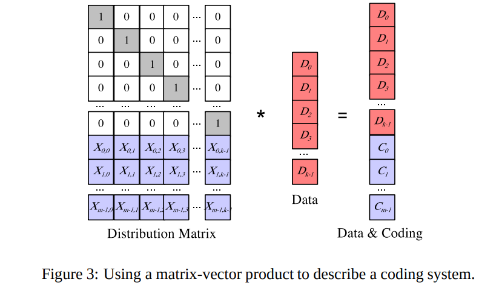
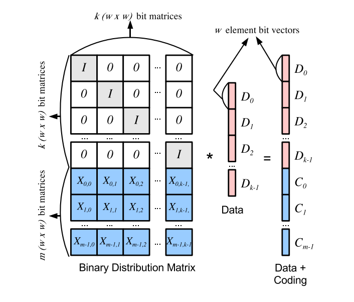
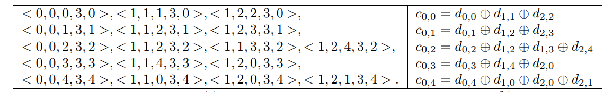

# **SIMD in Ceph**

- [SIMD in Ceph](#SIMD in Ceph)
    - [关于工具](#关于工具：Jerasure Version 2.0)
    	- [简介](#简介)
    	- [我们想做的](#我们想做的) 
    - [4.26的工作](#4.26)
    	- [Jerasure Libary 的组成模块及其功能](#Jerasure Libary 的组成模块) 
    - [4.28的工作](#4.28)
        - [纠删码编解码的原理](#纠删码编解码的原理：)
        - [位矩阵编码原理](#位矩阵编码原理：)
        - [使用schedule(列表)而不是位矩阵](#使用schedule(列表)而不是位矩阵)

## 关于工具：Jerasure Version 2.0

### 简介：

&emsp;Jerasue这个库是由James S. Plank先生实现的，是一个实现纠删码的C语言仓库。并且，2.0版本在实现伽罗华域运算的后端时，采用了GF-Complete算法库，同时还采用了Intel SIMD指令集来加速RS编解码过程。

​	源代码地址：https://github.com/ceph/jerasure

### 我们想做的

​	Ceph纠删码实现中的SIMD加速

&emsp;目前只是在阅读Plank先生的代码，希望以后可以应用在ceph纠删码中。

## 4.26 

### Jerasure Libary 的组成模块

1. **galois.h/galois.c**:

   这是给GF-Complete做的一层包装，从而可以继续使用jerasure version1.2的界面

2. **jerasure.h/jerasure.c**:

   这个模块是核心代码，并且只依赖于**galois**模块。这个模块的功能是支持对基于矩阵的编码和解码，基于位矩阵的编码和解码，位矩阵到调度的转换，矩阵和位矩阵求逆的支持。(来源于谷歌翻译，具体下周看了源代码再说）

3. **reed sol.h/reed sol.c:**

   用于为Reed-Solomon编码创建生成矩阵，还包括针对RAID-6的Reed-Solomon编码的优化版本。

4. **cauchy.h/cauchy.c:**

   这个模块用于生成柯西RS编码生成矩阵[BKK+95, PX06]，也支持为RAID-6创建最佳Cauchy发生矩阵。
   
5. **liberation.h/liberation.c:**

   These are procedures for performing RAID-6 coding and decoding with minimal
   density MDS codes [PBV11] — the RAID-6 Liberation codes [Pla08], Blaum-Roth codes [BR99] and the
   RAID-6 Liber8tion code [Pla09]. (抱歉，看不懂)

## 4.28

### 纠删码编解码的原理：

​	**分布矩阵**的前k行组成k×k单位矩阵。剩余的m行称为编码矩阵，并以各种方式定义[Rab89，Pre89，BKK 95，PD05]。如下面Figure 3所示：

​	分布矩阵乘以数据字组成的向量D，并产生包含原数据和编码字的乘积向量。因此，为了编码，我们需要用数据执行分布矩阵的点积。

​	为了**解码**，我们注意到系统中的每个单词都有一个相应的分布矩阵行。当设备发生故障时，我们从分布的k行创建一个解码矩阵，该矩阵对应于非故障设备。请注意，此k行的解码矩阵乘以原始数据等于剩余的k个幸存者。如果我们对这个矩阵求逆并将其乘以等式的两边，就求出了原始数据。

### 位矩阵编码原理：

​	位编码矩阵最初是在原始的Cauchy Reed-Solomon编码论文上的[BKK 95]。为了使用位矩阵进行编码和解码，我们在每个方向上将原来的分布矩阵扩展了w倍，位矩阵的分布矩阵规模是w(k + m) × wk，称为二元分布矩阵。将其乘以wk元素向量，该向量由来自k个数据设备的w位组成，如下所示：

​	其中，原来的分布矩阵每一个元素现在都变成了一个w*w的方阵，D向量的每个数据块都是一个w位的向量。

​	与GF（2w）中的矩阵向量乘积一样，乘积的每一行对应于**二元分布矩阵**的一行，并且为该行和数据向量的点积。由于所有元素都是位，我们可以通过获取矩阵行中元素为1的每个数据位的**XOR**来执行点积。换句话说，我们不是通过加法和乘法来执行点积，而是仅使用XOR执行它。**该点积的性能(计算量)与行中的1的数量直接相关**。因此，我们有必要找到1比较少的分布矩阵。使用位矩阵进行解码与GF（2w）上的矩阵相同，除了现在每个设备对应于矩阵的w行，而不是一行。还要记住，上述说明中的w位可能对应于实现中的一个数据包。

### 使用schedule(列表)而不是位矩阵

​	如上所述，由于最终找到的分布矩阵比较稀疏，这里采用五元组列表的数据结构来表示用分布矩阵来编码，采用预编译的方式来增加编码效率：

​																	**< op, sd, sb, dd, db >**

​	其中op是操作码：0表示复制，1表示XOR，sd是源设备的id，sb是源设备的位。最后两个元素dd和db是目标设备和位。按照惯例，我们使用从0到k+m -1的整数来编号设备.用i(0<=i <k)标识数据设备Di，并且用i(k+m>i≥k)标识编码设备Ci-k。

​	上面是使用5-tuples数据结构编译如上的二元分布矩阵的示例，其中k=3,w=5。

## 5.6

### Jerasure库的第一部分：伽罗华域算法

1. galois_single_multiply(int a, int b, int w)和galois_single_divide(int a, int b, int w)：

   这两个算法可以执行GF(2^w)伽罗华域上的两个元素的乘法和除法。

2. galois_region_xor(char *r1, char *r2, char *r3, int nbytes):

   这算法执行两个字节区域的异或，并且把结果放在r3。注意r3可能等于or1或者r2，如果我们用sum替换其r1或r2. Nbytes必须是机器的字长大小的倍数。

3. galois_w08_region_multiply(char *region,  int  multby,  int  nbytes,  char  *r2,  int  add):

   这算法执行字节区域乘以常数在GF（2^8）域上。如果r2是空指针，那么region指针的内容被覆盖写。否则，如果add为零，乘积将被放置在r2中。 如果add非零，就用乘积和r2进行XOR。

4. galois_w16_region_multiply() and galois_w32_region_multiply():

   和w08类似，只是域不一样

5. galois_change_technique(gf_t *gf, int w):

   这算法允许从GF-Complete创建GaloisField算法的自定义实现。要做到这一点，从GF-Complete手册中看create_gf_from_argv（）或者gf_init_hard（）。这些程序允许你创建一个gf_t(这是什么，我还不太清楚)，然后使用galois_change_technique（）使用这个gf_t来让jerasure用它。

6. galois_init_field() and galois init_composite_field():

   这两个算法会使用GF-Complete中的参数来创建gf_t指针，但是Jerasure官方建议使create_gf_from_argv（）或者gf_init_hard（）。

7. galois_get_field_ptr(int w):

   对于一个特定的w值，返回一个正在被jerasure使用的gf_t指针。

### Jerasure库的第二部分：核心例程

1. 首先介绍一些常用于乘法程序的参数：
   - int k： 数据设备的个数
   - int m： 编码设备的个数
   - int w： 编码的字长
   - int packetsize： 每个数据包的大小，必须是sizeof（long）的整数倍
   - int size： 每个设备的总字节数，必须是sizeof（long）的整数倍。如果一个位生成矩阵被应用，那么它的元素必须是packetsize*w的整数倍。如果想要对不符合上述条件的数据块进行编码，那么他必须补零
   - int *matrix： 这是一个带有k * m个元素的数组，它代表编码矩阵 - 即生成矩阵的最后一行。其元素必须介于0和2w-1之间。 第i行第j列的元素就是matrix [i * k j]。
   - int *bitmatrix： 这是构成BDM（binary distributed matrix）最后一行的w * m * w * k元素的数组。 第i行第j列的元素就是bitmatrix [i * k * w j]。、
   - 还有一些，打算直接去读代码，再回来对着表理解

## 5.22

### **Jerasure1.2库的单独编译使用：**

​		今天主要是把Jerasure在ubuntu18.04系统上编译运行了一下，并将一张图片按照cauchy编码的方式编码成4个数据块和2个检验块，并随便删去两个数据块之后再解码成原来的图片。

​		使用./encoder 'input file name' k m 'encode way' bit-word_size packet_size buffer_size命令进行编码，其中k是数据块的数目，m是检验块的数目，这些数目在不同的编码方式下有不同的要求。bit-word_size是伽罗华域的w，packet_size是每个packet的大小，buffer_size是一次处理的packet的数目。编码的结果是在编码得到的数据块和检验块出现在相对路径下的Coding文件夹中，同时还有一个txt文档记录这个文件的编码信息。

​		解码时只需要./deconder 'input file name'，就可以得到被编码的文件。

### Jerasure2.0库的单独编译使用：

​		由于gf-complete和jerasure2.0都需要用到autoconf工具进行编译，这里先来介绍autoconf和automake，在在这两个库里，可以看到没有makefile文件，只有configure.ac和makefile.am文件，执行autoconf可以产生configure，执行automake可以产生makefile.in文件，最后执行configure可以产生makefile，如果之前几步都没有报错，就可以执行make命令，开始编译。

​		现在，我在执行automake这一步时还有报错，报错信息显示有一个文件找不到，具体原因和解决方案下次更新吧。

## 5.26

​		Jearsure2.0库的单独编译存在问题，经过多次尝试编译后仍然没有成功。现在只能期待以后在对ceph的整体编译时再解决这个问题了。

​		今天除了尝试编译jerasure库之外，开始使用source insight4.0开始阅读ceph的erasure code部分，今天主要是熟悉该软件的使用。

​		接下来还要做的事情是理解现在的ceph系统在修改文件时是如何覆盖原有数据的，以及如何把APFS系统中写时拷贝、增量修改的机制引入到ceph里面。

作者：刘硕 
