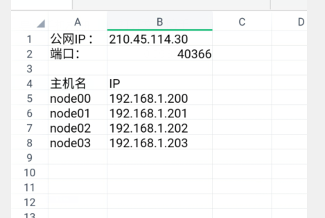
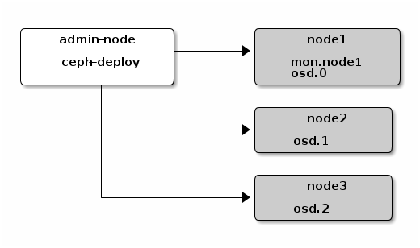
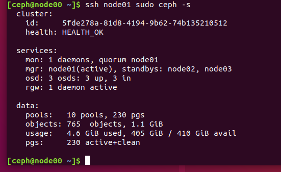
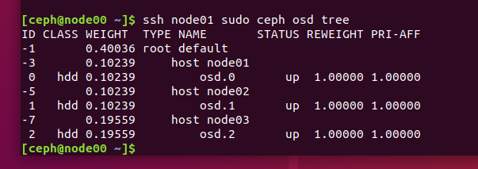
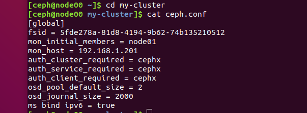

# ceph物理机搭建
## 起因
由于开始的时候在虚拟机的时候会收到ip改变的影响，而且对于虚拟机而言网络带宽和存储空间也是非常有限的，所以我们在之后决定向实验室的学长借了四台物理机来搭建我们ceph的平台。这里也非常需要感谢徐亮亮学长给我们的帮助，还给了我们机器来搭建。
## 机器配置
那学长给我们的机器配置大致如下：

##安装 Ceph 部署工具  
把 Ceph 仓库添加到 ceph-deploy 管理节点，然后安装 ceph-deploy 。  
### 高级包管理工具（APT）  
在 Debian 和 Ubuntu 发行版上，执行下列步骤：    
添加 release key ：    

	wget -q -O- 'https://download.ceph.com/keys/release.asc' | sudo apt-key add -

添加Ceph软件包源，用Ceph稳定版（如 cuttlefish 、 dumpling 、 emperor 、 firefly 等等）替换掉 {ceph-stable-release} 。例如：    

	echo deb http://download.ceph.com/debian-{ceph-stable-release}/ $(lsb_release -sc) main | sudo tee /etc/apt/sources.list.d/ceph.list

更新你的仓库，并安装 ceph-deploy ：    

	sudo apt-get update && sudo apt-get install ceph-deploy

Note 你也可以从欧洲镜像 eu.ceph.com 下载软件包，只需把 http://ceph.com/ 替换成 http:/eu.ceph.com/ 即可。     
### 红帽包管理工具（RPM）
在 Red Hat （rhel6、rhel7）、CentOS （el6、el7）和 Fedora 19-20 （f19 - f20） 上执行下列步骤：
在 RHEL7 上，用 subscription-manager 注册你的目标机器，确认你的订阅， 并启用安装依赖包的“Extras”软件仓库。例如 ：   

	sudo subscription-manager repos --enable=rhel-7-server-extras-rpms

在 RHEL6 上，安装并启用 Extra Packages for Enterprise Linux (EPEL) 软件仓库。 请查阅 EPEL wiki 获取更多信息。    
在 CentOS 上，可以执行下列命令：  

	sudo yum install -y yum-utils && sudo yum-config-manager --add-repo https://dl.fedoraproject.org/pub/epel/7/x86_64/ && sudo yum install --nogpgcheck -y epel-release && sudo rpm --import /etc/pki/rpm-gpg/RPM-GPG-KEY-EPEL-7 && sudo rm /etc/yum.repos.d/dl.fedoraproject.org*

把软件包源加入软件仓库。用文本编辑器创建一个 YUM (Yellowdog Updater, Modified) 库文件，其路径为 /etc/yum.repos.d/ceph.repo 。例如：  

	sudo vim /etc/yum.repos.d/ceph.repo

把如下内容粘帖进去，用 Ceph 的最新主稳定版名字替换 {ceph-stable-release} （如 firefly ），用你的Linux发行版名字替换 {distro} （如 el6 为 CentOS 6 、 el7 为 CentOS 7 、 rhel6 为 Red Hat 6.5 、 rhel7 为 Red Hat 7 、 fc19 是 Fedora 19 、 fc20 是 Fedora 20 ）。最后保存到 /etc/yum.repos.d/ceph.repo 文件中。  

	[ceph-noarch]
	name=Ceph noarch packages
	baseurl=http://download.ceph.com/rpm-{ceph-release}/{distro}/noarch
	enabled=1
	gpgcheck=1
	type=rpm-md
	gpgkey=https://download.ceph.com/keys/release.asc

更新软件库并安装 ceph-deploy ：  

	sudo yum update && sudo yum install ceph-deploy

Note 你也可以从欧洲镜像 eu.ceph.com 下载软件包，只需把 http://ceph.com/ 替换成 http://eu.ceph.com/ 即可。   
## Ceph 节点安装  
你的管理节点必须能够通过 SSH 无密码地访问各 Ceph 节点。如果 ceph-deploy 以某个普通用户登录，那么这个用户必须有无密码使用 sudo 的权限。
安装 NTP
我们建议在所有 Ceph 节点上安装 NTP 服务（特别是 Ceph Monitor 节点），以免因时钟漂移导致故障，详情见时钟。
### 在 CentOS / RHEL 上，执行：

	sudo yum install ntp ntpdate ntp-doc

### 在 Debian / Ubuntu 上，执行：  

	sudo apt-get install ntp

确保在各 Ceph 节点上启动了 NTP 服务，并且要使用同一个 NTP 服务器，详情见 NTP 。
## 安装 SSH 服务器
在所有 Ceph 节点上执行如下步骤：  
在各 Ceph 节点安装 SSH 服务器（如果还没有）：  

	sudo apt-get install openssh-server

或者

	sudo yum install openssh-server

确保所有 Ceph 节点上的 SSH 服务器都在运行。   
## 创建部署 Ceph 的用户
ceph-deploy 工具必须以普通用户登录 Ceph 节点，且此用户拥有无密码使用 sudo 的权限，因为它需要在安装软件及配置文件的过程中，不必输入密码。   
较新版的 ceph-deploy 支持用 --username 选项提供可无密码使用 sudo 的用户名（包括 root ，虽然不建议这样做）。使用 ceph-deploy --username {username} 命令时，指定的用户必须能够通过无密码 SSH 连接到 Ceph 节点，因为 ceph-deploy 中途不会提示输入密码。  
我们建议在集群内的所有 Ceph 节点上给 ceph-deploy 创建一个特定的用户，但不要用 “ceph” 这个名字。全集群统一的用户名可简化操作（非必需），然而你应该避免使用知名用户名，因为黑客们会用它做暴力破解（如 root 、 admin 、 {productname} ）。后续步骤描述了如何创建无 sudo 密码的用户，你要用自己取的名字替换 {username} 。  
Note 从 Infernalis 版起，用户名 “ceph” 保留给了 Ceph 守护进程。如果 Ceph 节点上已经有了 “ceph” 用户，升级前必须先删掉这个用户。   
在各 Ceph 节点创建新用户。

	ssh user@ceph-server
	sudo useradd -d /home/{username} -m {username}
	sudo passwd {username}

确保各 Ceph 节点上新创建的用户都有 sudo 权限。

	echo "{username} ALL = (root) NOPASSWD:ALL" | sudo tee /etc/sudoers.d/{username}
	sudo chmod 0440 /etc/sudoers.d/{username}

允许无密码 SSH 登录
正因为 ceph-deploy 不支持输入密码，你必须在管理节点上生成 SSH 密钥并把其公钥分发到各 Ceph 节点。 ceph-deploy 会尝试给初始 monitors 生成 SSH 密钥对。
生成 SSH 密钥对，但不要用 sudo 或 root 用户。提示 “Enter passphrase” 时，直接回车，口令即为空：
		ssh-keygen

	Generating public/private key pair.
	Enter file in which to save the key (/ceph-admin/.ssh/id_rsa):
	Enter passphrase (empty for no passphrase):
	Enter same passphrase again:
	Your identification has been saved in /ceph-admin/.ssh/id_rsa.
	Your public key has been saved in /ceph-admin/.ssh/id_rsa.pub.

把公钥拷贝到各 Ceph 节点，把下列命令中的 {username} 替换成前面创建部署 Ceph 的用户里的用户名。
	ssh-copy-id {username}@node1
	ssh-copy-id {username}@node2
	ssh-copy-id {username}@node3
（推荐做法）修改 ceph-deploy 管理节点上的 ~/.ssh/config 文件，这样 ceph-deploy 就能用你所建的用户名登录 Ceph 节点了，而无需每次执行 ceph-deploy 都要指定 --username {username} 。这样做同时也简化了 ssh 和 scp 的用法。把 {username} 替换成你创建的用户名。

	Host node1
   		Hostname node1
   		User {username}
	Host node2
   		Hostname node2
  		User {username}
	Host node3
   		Hostname node3
   		User {username}

### 引导时联网
Ceph 的各 OSD 进程通过网络互联并向 Monitors 上报自己的状态。如果网络默认为 off ，那么 Ceph 集群在启动时就不能上线，直到你打开网络。   
某些发行版（如 CentOS ）默认关闭网络接口。所以需要确保网卡在系统启动时都能启动，这样 Ceph 守护进程才能通过网络通信。例如，在 Red Hat 和 CentOS 上，需进入 /etc/sysconfig/network-scripts 目录并确保 ifcfg-{iface} 文件中的 ONBOOT 设置成了 yes 。   
### 确保联通性  
用 ping 短主机名（ hostname -s ）的方式确认网络联通性。解决掉可能存在的主机名解析问题。
Note 主机名应该解析为网络 IP 地址，而非回环接口 IP 地址（即主机名应该解析成非 127.0.0.1 的IP地址）。如果你的管理节点同时也是一个 Ceph 节点，也要确认它能正确解析自己的主机名和 IP 地址（即非回环 IP 地址）。   
### 开放所需端口  
Ceph Monitors 之间默认使用 6789 端口通信， OSD 之间默认用 6800:7300 这个范围内的端口通信。详情见网络配置参考。 Ceph OSD 能利用多个网络连接进行与客户端、monitors、其他 OSD 间的复制和心跳的通信。  
某些发行版（如 RHEL ）的默认防火墙配置非常严格，你可能需要调整防火墙，允许相应的入站请求，这样客户端才能与 Ceph 节点上的守护进程通信。  
对于 RHEL 7 上的 firewalld ，要对公共域开放 Ceph Monitors 使用的 6789 端口和 OSD 使用的 6800:7300 端口范围，并且要配置为永久规则，这样重启后规则仍有效。例如：   

	sudo firewall-cmd --zone=public --add-port=6789/tcp --permanent  

若使用 iptables ，要开放 Ceph Monitors 使用的 6789 端口和 OSD 使用的 6800:7300 端口范围，命令如下：  

	sudo iptables -A INPUT -i {iface} -p tcp -s {ip-address}/{netmask} --dport 6789 -j ACCEPT

在每个节点上配置好 iptables 之后要一定要保存，这样重启之后才依然有效。例如：  
/sbin/service iptables save  
## 终端（ TTY ）  
在 CentOS 和 RHEL 上执行 ceph-deploy 命令时可能会报错。如果你的 Ceph 节点默认设置了 requiretty ，执行 sudo visudo 禁用它，并找到 Defaults requiretty 选项，把它改为 Defaults:ceph !requiretty 或者直接注释掉，这样 ceph-deploy 就可以用之前创建的用户（创建部署 Ceph 的用户 ）连接了。  
Note 编辑配置文件 /etc/sudoers 时，必须用 sudo visudo 而不是文本编辑器。   
### SELinux  
在 CentOS 和 RHEL 上， SELinux 默认为 Enforcing 开启状态。为简化安装，我们建议把 SELinux 设置为 Permissive 或者完全禁用，也就是在加固系统配置前先确保集群的安装、配置没问题。用下列命令把 SELinux 设置为 Permissive ：  

	sudo setenforce 0  

要使 SELinux 配置永久生效（如果它的确是问题根源），需修改其配置文件 /etc/selinux/config 。
### 优先级/首选项  
确保你的包管理器安装了优先级/首选项包且已启用。在 CentOS 上你也许得安装 EPEL ，在 RHEL 上你也许得启用可选软件库。  
 
	sudo yum install yum-plugin-priorities  

比如在 RHEL 7 服务器上，可用下列命令安装 yum-plugin-priorities并启用 rhel-7-server-optional-rpms 软件库：  

	sudo yum install yum-plugin-priorities --enablerepo=rhel-7-server-optional-rpms
## 存储集群快速入门
我们在这里依然创建之前的配置一样的ceph  

首先需要创建  

	mkdir my-cluster
	cd my-cluster

### 创建集群
如果在某些地方碰到麻烦，想从头再来，可以用下列命令清除配置：

	ceph-deploy purgedata {ceph-node} [{ceph-node}]
	ceph-deploy forgetkeys

用下列命令可以连 Ceph 安装包一起清除：

	ceph-deploy purge {ceph-node} [{ceph-node}]

如果执行了 purge ，你必须重新安装 Ceph 。
在管理节点上，进入刚创建的放置配置文件的目录，用 ceph-deploy 执行如下步骤。
创建集群。

	ceph-deploy new {initial-monitor-node(s)}

例如：

	ceph-deploy new node1

在当前目录下用 ls 和 cat 检查 ceph-deploy 的输出，应该有一个 Ceph 配置文件、一个 monitor 密钥环和一个日志文件。详情见 ceph-deploy new -h 。
把 Ceph 配置文件里的默认副本数从 3 改成 2 ，这样只有两个 OSD 也可以达到 active + clean 状态。把下面这行加入 [global] 段：
osd pool default size = 2
如果你有多个网卡，可以把 public network 写入 Ceph 配置文件的 [global] 段下。详情见网络配置参考。

	public network = {ip-address}/{netmask}

### 安装 Ceph 。
	ceph-deploy install {ceph-node} [{ceph-node} ...]

例如：  

	ceph-deploy install admin-node node1 node2 node3

ceph-deploy 将在各节点安装 Ceph 。 注：如果你执行过 ceph-deploy purge ，你必须重新执行这一步来安装 Ceph 。  
配置初始 monitor(s)、并收集所有密钥： 
 
	ceph-deploy mon create-initial

完成上述操作后，当前目录里应该会出现这些密钥环：

	{cluster-name}.client.admin.keyring
	{cluster-name}.bootstrap-osd.keyring
	{cluster-name}.bootstrap-mds.keyring
	{cluster-name}.bootstrap-rgw.keyring

Note 只有在安装 Hammer 或更高版时才会创建 bootstrap-rgw 密钥环。 
Note 如果此步失败并输出类似于如下信息 “Unable to find /etc/ceph/ceph.client.admin.keyring”，请确认 ceph.conf 中为 monitor 指定的 IP 是 Public IP，而不是 Private IP。 
添加两个 OSD 。为了快速地安装，这篇快速入门把目录而非整个硬盘用于 OSD 守护进程。如何为 OSD 及其日志使用独立硬盘或分区，请参考 ceph-deploy osd 。登录到 Ceph 节点、并给 OSD 守护进程创建一个目录。

	ssh node2
	sudo mkdir /var/local/osd0
	exit

	ssh node3
	sudo mkdir /var/local/osd1

	exit
然后，从管理节点执行 ceph-deploy 来准备 OSD 。

	ceph-deploy osd prepare {ceph-node}:/path/to/directory

例如：

	ceph-deploy osd prepare node2:/var/local/osd0 node3:/var/local/osd1

最后，激活 OSD 。

	ceph-deploy osd activate {ceph-node}:/path/to/directory

例如：

	ceph-deploy osd activate node2:/var/local/osd0 node3:/var/local/osd1

用 ceph-deploy 把配置文件和 admin 密钥拷贝到管理节点和 Ceph 节点，这样你每次执行 Ceph 命令行时就无需指定 monitor 地址和 ceph.client.admin.keyring 了。

	ceph-deploy admin {admin-node} {ceph-node}

例如：

	ceph-deploy admin admin-node node1 node2 node3

ceph-deploy 和本地管理主机（ admin-node ）通信时，必须通过主机名可达。必要时可修改 /etc/hosts ，加入管理主机的名字。
确保你对 ceph.client.admin.keyring 有正确的操作权限。

	sudo chmod +r /etc/ceph/ceph.client.admin.keyring

检查集群的健康状况。

	ceph health

等 peering 完成后，集群应该达到 active + clean 状态。
操作集群
用 ceph-deploy 部署完成后它会自动启动集群。要在 Debian/Ubuntu 发行版下操作集群守护进程，参见用 Upstart 运行 Ceph ；要在 CentOS 、 Red Hat 、 Fedora 和 SLES 下操作集群守护进程，参见用 sysvinit 运行 Ceph 。
关于 peering 和集群健康状况请参见监控集群；关于 OSD 守护进程和归置组（ placement group ）健康状况参见监控 OSD 和归置组；关于用户管理请参见用户管理。
Ceph 集群部署完成后，你可以尝试一下管理功能、 rados 对象存储命令，之后可以继续快速入门手册，了解 Ceph 块设备、 Ceph 文件系统和 Ceph 对象网关。
扩展集群（扩容）
一个基本的集群启动并开始运行后，下一步就是扩展集群。在 node1 上添加一个 OSD 守护进程和一个元数据服务器。然后分别在 node2 和 node3 上添加 Ceph Monitor ，以形成 Monitors 的法定人数。
 
### 添加 OSD
你运行的这个三节点集群只是用于演示的，把 OSD 添加到 monitor 节点就行。

	ssh node1
	sudo mkdir /var/local/osd2
	exit

然后，从 ceph-deploy 节点准备 OSD 。

	ceph-deploy osd prepare {ceph-node}:/path/to/directory

例如：

	ceph-deploy osd prepare node1:/var/local/osd2

最后，激活 OSD 。

	ceph-deploy osd activate {ceph-node}:/path/to/directory

例如：
	ceph-deploy osd activate node1:/var/local/osd2

一旦你新加了 OSD ， Ceph 集群就开始重均衡，把归置组迁移到新 OSD 。可以用下面的 ceph 命令观察此过程：

	ceph -w

你应该能看到归置组状态从 active + clean 变为 active ，还有一些降级的对象；迁移完成后又会回到 active + clean 状态（ Control-C 退出）。
添加元数据服务器
至少需要一个元数据服务器才能使用 CephFS ，执行下列命令创建元数据服务器：

	ceph-deploy mds create {ceph-node}

例如：

	ceph-deploy mds create node1

Note 当前生产环境下的 Ceph 只能运行一个元数据服务器。你可以配置多个，但现在我们还不会为多个元数据服务器的集群提供商业支持。 
添加 RGW 例程
要使用 Ceph 的 Ceph 对象网关组件，必须部署 RGW 例程。用下列方法创建新 RGW 例程：

	ceph-deploy rgw create {gateway-node}

例如：

	ceph-deploy rgw create node1

Note 这个功能是从 Hammer 版和 ceph-deploy v1.5.23 才开始有的。 
RGW 例程默认会监听 7480 端口，可以更改该节点 ceph.conf 内与 RGW 相关的配置，如下：

	[client]
	rgw frontends = civetweb port=80

用的是 IPv6 地址的话：

	[client]
	rgw frontends = civetweb port=[::]:80

### 添加 Monitors
Ceph 存储集群需要至少一个 Monitor 才能运行。为达到高可用，典型的 Ceph 存储集群会运行多个 Monitors，这样在单个 Monitor 失败时不会影响 Ceph 存储集群的可用性。Ceph 使用 PASOX 算法，此算法要求有多半 monitors（即 1 、 2:3 、 3:4 、 3:5 、 4:6 等 ）形成法定人数。
新增两个监视器到 Ceph 集群。

	ceph-deploy mon add {ceph-node}

例如：

	ceph-deploy mon add node2 node3

新增 Monitor 后，Ceph 会自动开始同步并形成法定人数。你可以用下面的命令检查法定人数状态：

	ceph quorum_status --format json-pretty
## 成果
如果你成功解决了在配置时具体遇到的一系列的问题，你最终可以看到如下的信息：

## 注意事项
需要自己修改ceph.conf文件，可以改成如下配置：  

最好的镜像是阿里云，其他的镜像好像都有出现过报错  

在创建osd之前，需要对磁盘进行格式化操作。
