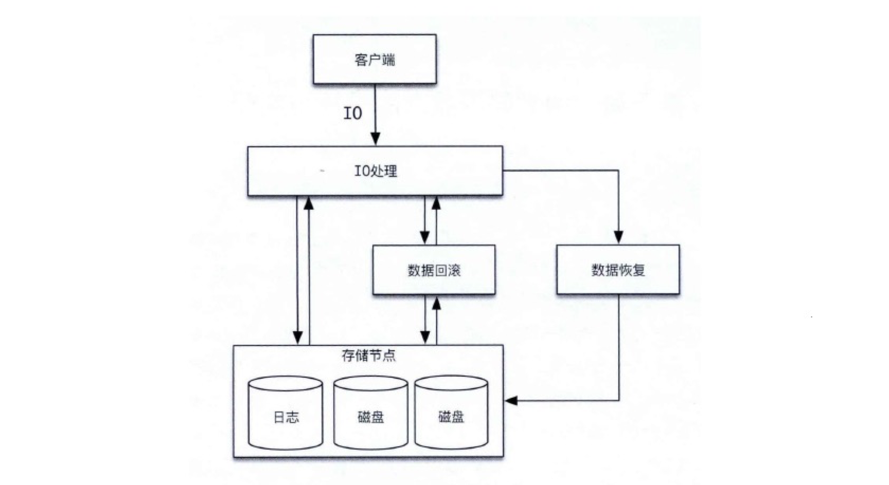
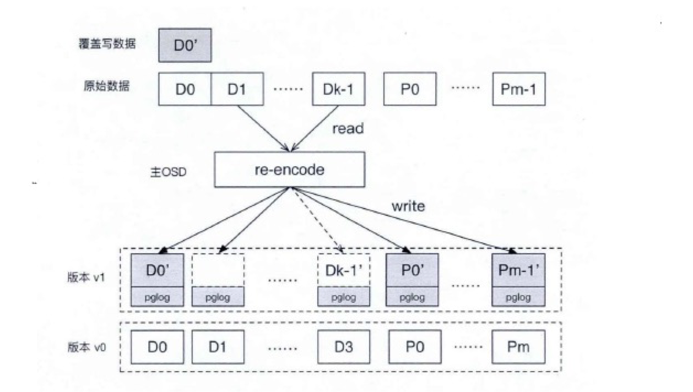
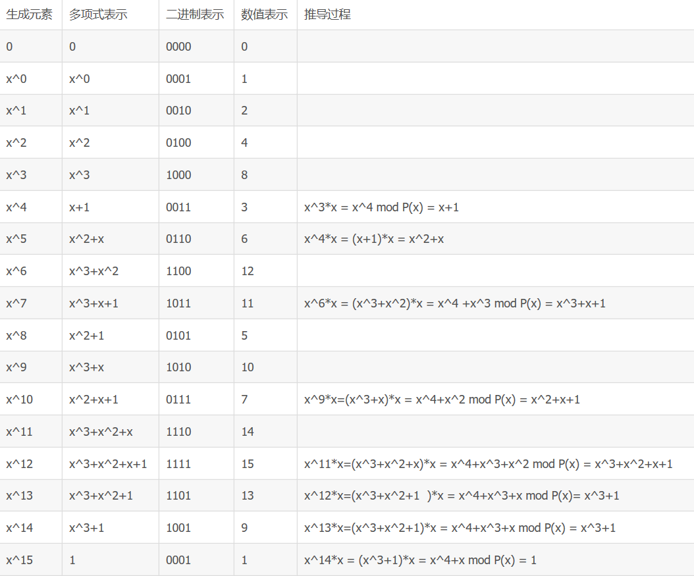

# 可行性报告


- [可行性报告](#可行性报告)
    - [项目简介](#项目简介)
    - [项目背景](#项目背景)
        - [分布式系统中的CAP理论](#分布式系统中的cap理论)
        - [纠删码](#纠删码)
            - [纠删码简介](#纠删码简介)
            - [纠删码的重要性](#纠删码的重要性)
        - [CEPH在I/O上存在的问题](#ceph在io上存在的问题)
        - [纠删码的覆盖写实现](#纠删码的覆盖写实现)
    - [覆盖写](#覆盖写)
        - [覆盖写的理论依据](#覆盖写的理论依据)
        - [覆盖写的技术依据](#覆盖写的技术依据)
            - [设计思路](#设计思路)
            - [方案](#方案)
    - [纠删码的柯西RS编码](#纠删码的柯西rs编码)
        - [柯西code在复杂性上的优化](#柯西code在复杂性上的优化)
            - [重要改进点：](#重要改进点)
            - [柯西编解码过程优化](#柯西编解码过程优化)
        - [柯西code的算法可行性](#柯西code的算法可行性)
            - [伽罗华域的四则运算](#伽罗华域的四则运算)
                - [有限域GF(2^w )](#有限域gf2^w-)
                - [GF（2^w ）上的多项式运算](#gf2^w-上的多项式运算)
                - [本原多项式](#本原多项式)
                - [通过本原多项式生成元素算法](#通过本原多项式生成元素算法)
                - [伽罗华域上的运算](#伽罗华域上的运算)
            - [柯西code在纠删码中的应用](#柯西code在纠删码中的应用)
                - [纠删码的三个重要参数](#纠删码的三个重要参数)
                - [生成冗余](#生成冗余)
                - [恢复原始数据](#恢复原始数据)
    - [SIMD](#simd)
        - [背景](#背景)
        - [SIMD优点](#simd优点)
        - [可用库-Vc library](#可用库-vc-library)
            - [简介](#简介)
            - [建造和安装VC](#建造和安装vc)
            - [文档](#文档)
    - [案例分析](#案例分析)
        - [增加对小文件读取的IO项目————cephfs_readline](#增加对小文件读取的io项目cephfs_readline)
            - [项目简介](#项目简介-1)
                - [原始方案](#原始方案)
                    - [总结](#总结)
                - [优化方案](#优化方案)
                    - [总结](#总结-1)
        - [基于上述项目，我们提出的基于Ceph的小文件处理方案](#基于上述项目我们提出的基于ceph的小文件处理方案)
            - [写小文件](#写小文件)
            - [读小文件](#读小文件)
            - [删除小文件](#删除小文件)
            - [软硬件结合优化](#软硬件结合优化)
            - [减少ceph读取小文件的IO深度](#减少ceph读取小文件的io深度)
            - [对不同的object去制定不同的Crush算法](#对不同的object去制定不同的crush算法)
    - [参考文献](#参考文献)


## 项目简介
基于Ceph，实现纠删码的使用和改进。具体的实现如下：  
在分块数量固定、每块512字节的存储格式上，使用柯西编解码方式，利用SIMD指令集加速数据的计算，实现类APFS以增量方式修改和写数据的功能，最后在有条件的情况下考虑文件的分布存储位置优化问题，通过冷热数据分层为其分配不同比例的数据块和校验块，实现更好的容错机制，从而达到对可用性的要求。

## 项目背景
### 分布式系统中的CAP理论
CAP原则又称CAP定理，指的是在一个分布式系统中， Consistency（一致性）、 Availability（可用性）、Partition tolerance（分区容错性），三者不可得兼。  
CAP原则是NOSQL数据库的基石。
分布式系统的CAP理论：理论首先把分布式系统中的三个特性进行了如下归纳：  

1. 一致性（C）：在分布式系统中的所有数据备份，在同一时刻是否同样的值。（等同于所有节点访问同一份最新的数据副本）
2. 可用性（A）：在集群中一部分节点故障后，集群整体是否还能响应客户端的读写请求。（对数据更新具备高可用性）
3. 分区容忍性（P）：以实际效果而言，分区相当于对通信的时限要求。系统如果不能在时限内达成数据一致性，就意味着发生了分区的情况，必须就当前操作在C和A之间做出选择。  

### 纠删码

#### 纠删码简介
分布式系统需要在硬件失效等故障发生后仍然能继续提供服务。就数据而言，HDFS采用每份数据3副本的方式，保证某些数据损失之后仍能继续使用。数据的容错除了副本还有另一种做法，就是把丢失的数据计算出来。这就是纠删码（erasure coding，EC）的思想了。它将数据分割成片段，把冗余数据块扩展、编码，并将其存储在不同的位置，比如磁盘、存储节点或者其它地理位置。

#### 纠删码的重要性
数据的爆炸式增长使得存储系统的规模不断增加，存储设备的可靠性却一直没有得到显著提高（SSD 从SLC 到MLC 和TLC 可靠性不断下降，磁盘随着单位面积写入数据更多导致可靠性无法提升），从而给数据的持久化存储带来巨大挑战。另外随着存储系统规模的增大，存储系统中的冷数据的增加将远超过热数据的增加，如何安全保存冷数据，在需要的时候能够获取冷数据也成为存储系统中的重要挑战。而纠删码对上述的问题都有较好的解决，因此在当下提及并改进纠删码的技术是有很强的实际意义的。

### CEPH在I/O上存在的问题
在ceph中进行数据的读写时存在读写IO路径过长的问题，这个问题在Ceph的客户端和服务器端都存在。以osd为例，一个IO需要经过message、OSD、FileJournal、FileStore多个模块才能完成，每个模块之间都涉及到队列和线程切换，部分模块在对IO进行处理时还要进行内存拷贝，导致整体性能不高。

### 纠删码的覆盖写实现
在调研报告中已经描述了恢复数据时的复杂性和性能劣势，纠删码由于需要K块数据才能完整还原原始数据，所以在分布式系统中对数据一致性的实现有特殊要求。采用（k，m）的纠删码，即原始数据切片k块，编码出m块校验块，分别存储在k+m个节点中。对于纠删码覆盖写，需要至少m+1个节点的参与，包括1个数据节点，m个校验块节点，当覆盖数据范围变大时，需要的节点也会更多。而（k，m）纠删码至多容忍m个节点的丢失，也就是需要k个节点才能解码原始数据，所以覆盖写更新需要保持至少k个节点数据版本一致。

## 覆盖写
### 覆盖写的理论依据
纠删码的每次修改，涉及到数据块的更新和校验块的更新，数据块的更新替换对应偏移数据即可，校验块的相对复杂，大致分为三种更新方式

1. 全覆盖写（Full stripe writes）：用于写大小是条带大小多倍的情况，全覆盖写不需要读取原有的数据块或者校验块，可以得到最佳的更新性能。处理小块写的一种方式是将多个小块封装为一个装块写。


2. 重构写（Reconstruct writes）：重构写首先读取没有涉及更新的数据块，然后合并覆盖写数据和读取的数据块，计算新的校验块。

3. 增量写（Read-modify writes）：增量写利用了纠删码的线形性，首先读取需要更新的原始数据块，然后计算原始数据块和新块的差值，并应用到校验块，最后需要将更新的数据块和校验块写入对应的位置。


下面用公式来描述利用纠删码线性计算来更新校验块的原理，其中校验块$ P_j $是数据块的线形组合。

$$ P_j = \sum_{x=0}^{k-1}a_{j,x}D_x ,j\in \{0,1,...m-1  \}        \tag 1\\$$

如果覆盖写后数据从$D_i $到$D_i' $,然后每个校验块会根据公式（2）重新构建：

$$ P_j‘ = \sum_{x=0}^{i-1}a_{j,x}D_x +a_{j,x}D_i'+\sum_{x=i+1}^{k-1}a_{j,x}D_x,j\in \{0,1,...m-1  \}        \tag 2\\$$


从公式（1）（2）可以得到：

$$ P_j‘ =P_j+a_{j,i}D_i'- a_{j,i}D_i,j\in \{0,1,...m-1  \}        \tag 3\\$$

根据分配律可以简化得到：

$$ P_j‘ =P_j+a_{j,i}（D_i'- D_i）,j\in \{0,1,...m-1  \}        \tag 4\\$$

从公式（4）可以看出，校验块的更新，需要两次读取原始数据，第一次读取需要更新的原始数据块用于计算和更新数据的差值，第二次读取需要更新的原始校验块，计算和增量之和得到新的校验块。
### 覆盖写的技术依据 
#### 设计思路

纠删码由于其特殊性，每一个数据分片都保存着唯一的数据。通过维护至少k块数据分片，来保持原始数据。而软件定义存储中，通常构建于廉价的通用x86服务器，每个节点，每块硬盘，都会发生故障。纠删码的每一次更新都会至少引入m+1个节点的数据更新，所以保持各数据节点的数据一致性，并且在发生故障时有效的恢复到上一次一致状态就比较困难。



一下根据不同的情况来讨论：

1. 需要更新节点数为m+1个节点的情况：那么原有k-1个节点是一致的，m+1个节点的更新成功也有几种状态，要么没有更新成功，要么至少有1个节点是更新成功了。第一种情况，则所有节点节点都没有更新成功，即写失败，那么所有节点都处于上一个数据一致状态。第二种状态，因为有k-1个节点一致，那么再加上任意一个节点即可以恢复出原始数据。有两种处理方式：
	- 判断更新成功的节点为最新状态，和原来k-1个节点同步数据最新版本号，即为新的数据一致状态，剩余m个未更新成功的节点在下一次同步状态时，会发现版本落后，则需要同步最新版本以及数据；
	- 判断更新失败的节点为最新状态，即判断本次更新失败，那么原来k-1个节点和没有更新的节点都处于数据一致的状态，有数据更新的节点在下一次同步状态时，会发现版本超前，即丢掉本地数据，再去恢复原始数据。

2. 需要更新节点数大于m+1的情况：更新节点变多后，容易出现数据分裂。未参数更新的节点小于k-1个节点，即至少需要2个节点才能恢复出原始数据。当更新节点中，没有2个节点能达成一致状态时，则就会造成数据丢失。进一步概括，当更新数为m+d时，原始数据有k-d个节点，当m+d<2d，即m<d时，就可能会出现更新不一致的情况。考虑一般情况，k会比较大，m会比较小，那么上述情况是比较常见的。综上所述，在分布式系统中，由于硬件等意外因素，要保证数据的可靠性，不在就删码更新中丢失数据，那么纠删码的更新不能像传统多副本一样直接更新在原始的位置。

#### 方案

设计如下的方案：

1. 客户端发出请求到主节点；
2. 主节点读取编码条带中重构新校验块需要读取的数据；
3. 主节点发送可写数据，各数据块节点将新的写操作放队列，进入准备提交阶段；
4. 所有节点准备完成后，主节点即回复客户端写完成；
5. 主节点发送后并请求到所有参与修改的节点，完成最终的写操作；


在准备阶段，覆盖写的数据写入临时对象来持久化，写操作信息进入准备提交的队列。在合并阶段，利用ObjectStore层的原子操作将临时对象数据合并到原属数据块。  

采用这样的两阶段提交，可以不破坏原始数据，保持数据更新的一致性。在准备阶段，所有参与更新的阶段接收写操作和写数据，所有节点回复完后，主节点即判断所有节点都成功接受了请求，即达到更新一致状态然后返回；在合并阶段，主节点发送合并请求，所有节点通过原子性事务来合并，原子性事务可以保证单个节点的合并完全完成或者完全不完成，在容忍m个节点失效的情况下，剩余至少k个节点一定都会保证在最新状态，即可以恢复出最新的原始数据。在出现失效节点时，通过再次合并或者恢复操作，即可得到该节点需要的数据。  

为降低单位存储的存储代价，纠删码存储通常采用机械盘，数据的存取需要胫骨寻道时间、旋转时间和数据传输，而寻道时间往往占用了大量时间，所以机械盘对随机IO性能较差，而对于连续IO，可以大量减少寻道时间。可以获得较高的读写性能。合并阶段数据需要先读再合并，在大量小块修改时，这些操作都是随机读写，会带来很大的性能损耗。为了提高合并时的吞吐量，尽量减少对正常IO的影响，所以采用批量合并的策略，即延迟合并操作。主节点回复客户端后，并不马上发送合并请求。覆盖写数据积累一定量后，通过批量合并，将大量随机IO编程连续的IO，可以大幅提高性能。批量合并的策略可以灵活定制。  

数据的布局影响着数据的存储效率，而在实际写数据中，每个节点除了需要记录更新的数据，还要记录本次更新的元数据信息。如图就是一个重构写的数据流图。中间节点为主节点，负责整个流程的数据管理。首先新数据$ D_0' $到达，$ D_0' $覆盖了$ D_0 $的数据范围，主节点判断后发送读请求到$ D_1 - D_{k-1} $，接受到数据后，重新编码出$ P_0' - P'_{m-1} $，得到覆盖数据后的新校验块，然后依次发送给涉及到的m+1个节点，没有参与更新的节点不会收到更新数据。同时，每个节点会记录本次更新的元数据，记录PG层的日志PGlog。




## 纠删码的柯西RS编码
### 柯西code在复杂性上的优化
#### 重要改进点：  
1. 用柯西矩阵来代替范德蒙矩阵。由于范德蒙矩阵求逆运算的复杂度为O（n^3），而柯西矩阵求逆运算的复杂度仅为O（n^2）。因此，采用柯西矩阵可以降低解码的运算复杂度。  
2. 采用有限域二进制矩阵的方式来提高运算效率，直接将乘法转换成XOR逻辑运算，大大降低了运算复杂度。
#### 柯西编解码过程优化
从编解码过程来看，柯西编解码最大的运算量是乘法和加法运算。   
从数学的角度来看，在迦罗华有限域中，任何一个GF（2^w）域上的元素都可以映射到GF（2）二进制域，并且采用一个二进制矩阵的方式表示GF（2^w）中的元素。例如，GF（2^3）域中的元素可以表示成GF（2）域中的二进制矩阵：


 
柯西编解码为了降低乘法复杂度，采用了有限域上的元素都可以使用二进制矩阵表示的原理，将乘法运算转换成了迦罗华域“与运算”和“XOR逻辑运算”，提高了编解码效率。柯西编码的运算复杂度为O（n(n- m)），解码复杂度为O（n^2 ）。
### 柯西code的算法可行性
#### 伽罗华域的四则运算
##### 有限域GF(2^w )
GF(p)中p必须是一个素数，才能保证集合中的所有元素都有加法和乘法逆元(0除外)。   
引入了GF(p^w )，其中p为素数，通常取p=2。计算机领域中经常使用的是GF(2^8 )，8刚好是一个字节的比特数。为了保证单位元性质，GF(2^w )上的加法运算和乘法运算，不再使用一般的加法和乘法，而是使用多项式运算。
##### GF（2^w ）上的多项式运算
对于GF（2^w ）上的多项式计算，多项式系数只能取 0或1。   
GF（2^w ）的多项式加法中，合并阶数相同的同类项时，由于0+0=0,1+1=0,0+1=1+0=1，因此系数不是进行加法操作，而是进行异或操作。
##### 本原多项式
伽罗华域的元素可以通过该域上的本原多项式生成。   
以GF(2^3 )为例，指数小于3的多项式共8个： 0， 1， x， x+1， x^2， x^2+1， x^2 + x， x^2+x+1。其系数刚好就是000,001, 010, 011, 100, 101, 110, 111，是0 到7这8个数的二进制形式。   
GF(2^3 )上有不只一个本原多项式，选一个本原多项式x^3 +x+1，这8个多项式进行四则运算后 mod (x^ 3+x+1)的结果都是8个之中的某一个。因此这8个多项式构成一个有限域。   
##### 通过本原多项式生成元素算法
设P(x)是GF（2^w）上的某一个本原多项式，GF（2^w ）的元素产生步骤是：   
1、给定一个初始集合，包含0,1和元素x，即 {0,1,x}；   
2、将这个集合中的最后一个元素，即x，乘以x，如果结果的度大于等于w，则将结果mod P(x)后加入集合；   
3、直到集合有2^w 个元素，此时最后一个元素乘以x再mod P(x)的值等于1。   
以GF(2^4 )为例，取本原多项式P(x)=x^4 +x+1，生成元素过程如下图。   

##### 伽罗华域上的运算
乘法运算转换成了迦罗华域“与运算”，加法运算转换成了伽罗华域“XOR逻辑运算”。
#### 柯西code在纠删码中的应用
##### 纠删码的三个重要参数
k：原始数据块数量，要求小于256   
m：冗余数据块数量，要求不大于256 - k
bytes：每块字节数，要求为8的整数倍
##### 生成冗余
以k = 32，m = 12， bytes = 1000为例   

    assert(bytes % 8 == 0);
	assert(data_len == k * bytes);

	char *recovery_blocks = new char[m * bytes];
	char *data_ptrs[32];

	// Point data_ptrs to data here

	// Encode the data using this library
	if (cauchy_256_encode(k, m, data_ptrs, recovery_blocks, bytes)) {
		// Input was invalid
		return false;
	}

	// For each recovery block,
	for (int ii = 0; ii < m; ++ii) {
		char *block = recovery_blocks + ii * bytes;
		unsigned char row = k + ii; // Transmit this with block (just one byte)

		// Transmit or store block bytes and row
	}

	delete []recovery_blocks;   
其中函数```cauchy_256_encode```是通过柯西code生成矩阵的函数，需要调用伽罗华域相关的函数，伽罗华域上的运算算法已简述。
##### 恢复原始数据
继续以k = 32，m = 12， bytes = 1000为例   

    Block *block_info = new Block[k];

	// Fill block_info here with data and rows from the encoder
	// Rows under k are original data, and the rest are redundant data

	// Attempt decoding
	if (cauchy_256_decode(k, m, block_info, bytes)) {
		// Decoding should never fail - indicates input is invalid
		assert(k + m <= 256);
		assert(block_info != 0);
		assert(bytes % 8 == 0);
		return false;
	}   
其中函数```cauchy_256_decode```是通过矩阵恢复原始数据的函数，核心在于矩阵的求逆运算。而求逆所需要的加法与减法运算，均在伽罗华域中可简化实现，即通过异或运算及与运算实现。


## SIMD
### 背景
最近几代的CPU，尤其是GPU，需要数据并行代码才能充分发挥效率。数据并行性要求对不同的输入数据应用相同的操作序列。因此，CPU和GPU可以减少指令解码和调度所需的硬件，而更多的算术和逻辑单元可以同时执行相同的指令。在CPU架构上，这是通过SIMD寄存器和指令实现的。单个SIMD寄存器可以存储n个值，单个SIMD指令可以对这些值执行n个操作。在GPU架构中，n个线程以完美的同步方式运行，由一个指令解码器/调度程序提供。每个线程都有本地内存和一个给定的索引，用于计算内存中加载和存储的偏移量。              
当前C++编译器可以将标量代码自动转换为SIMD指令（自动矢量化）。然而，编译器必须重构当开发人员在C++中编写纯标量实现时丢失的算法的固有属性。因此，C++编译器无法将任何给定的代码向量化为其最有效的数据并行变量。尤其是跨越多个函数甚至翻译单元的大型数据并行循环，通常不会转换为有效的SIMD代码。 
### SIMD优点
以加法指令为例，单指令单数据（SISD）的CPU对加法指令译码后，执行部件先访问内存，取得第一个操作数；之后再一次访问内存，取得第二个操作数；随后才能进行求和运算。而在SIMD型的CPU中，指令译码后几个执行部件同时访问内存，一次性获得所有操作数进行运算。这个特点使SIMD特别适合于多媒体应用等数据密集型运算。
### 使用方案
通过 SIMD 扩展来加速编码算法, 并将数据编码与数据提交重叠。这也是已经经过验证的方法，所以我们很相信我们可以用这个方法来加速编码的计算。
### 可用库-Vc library
#### 简介
VC库提供缺少的链接。它的类型支持显式声明对多个值的数据并行操作。因此，并行性是通过类型系统添加的。相互竞争的方法通过新的控制结构来说明并行性，从而在这些控制结构的主体中建立新的语义。              VC是一个自由软件库，用于简化C++代码的显式矢量化。它有一个直观的API，提供了不同编译器和编译器版本之间的可移植性，以及不同矢量指令集之间的可移植性。因此，用vc编写的应用程序可以编译为：  
AVX and AVX2  
SSE2 up to SSE4.2 or SSE4a  
Scalar  
AVX-512 (Vc 2 development)  
NEON (in development)  
NVIDIA GPUs / CUDA (research)  
#### 建造和安装VC  
- 克隆后，需要初始化vc的git子模块：   

```
	git submodule update --init
```

- 创建生成目录：  

``` 
	$ mkdir build
	$ cd build
```
- 构建和安装

```
	$ make -j16  	
	$ make install
```
	
#### 文档
文档是通过doxygen生成的，可以通过在Doc子目录中运行doxygen来构建文档。
* [1.4 branch](https://vcdevel.github.io/Vc-1.4/)
* [1.4.1 release](https://vcdevel.github.io/Vc-1.4.1/)
* [1.4.0 release](https://vcdevel.github.io/Vc-1.4.0/)
* [1.3 branch](https://vcdevel.github.io/Vc-1.3/)
* [1.3.0 release](https://vcdevel.github.io/Vc-1.3.0/)
* [1.2.0 release](https://vcdevel.github.io/Vc-1.2.0/)
* [1.1.0 release](https://vcdevel.github.io/Vc-1.1.0/)
* [0.7 branch](https://vcdevel.github.io/Vc-0.7/)
。

##案例分析

### 增加对小文件读取的IO项目————cephfs_readline 
#### 项目简介
##### 原始方案
**流程图** 


**说明**
  - 假如用户拉取的文件大小是16M, 文件按照4M切分，散落到四个数据片上
  - 用户首先请求cephfs拉取文件信息
  -  cephfs会根据crush算法找计算文件散落到那几个数据片上
  - cephfs会拉取文件所属的数据片然后聚合起来
  - cephfs文件拉取后返回给用户
  - 用户拉取完整个文件，开始做过滤关键字操作
  - 
**优点**
- 简单方便
- 开发成本低

**缺点**
- 用户端检索延迟大，影响用户体验
- 客户端集群网卡带宽波动较大，带宽有限，每次都需要把大日志文件拉取到客户端
- 对ceph集群负载也有波动影响
 
###### 总结
用户拉取文件，必须先通过cephfs拉取文件到本地，然后根据关键字检索这行数据。如果用户检索量比较大的时候，并且文件大小都不统一，拉取文件越大网络延迟越高，并且在大文件中过滤关键字效率非常低，严重影响用户的体验。

##### 优化方案
**流程图**


**说明**
- 用户发起请求输入文件名和key关键字到达索引层
- 索引层根据key找到对应的offset信息，然后传给dss-readline
- dss-readline根据cephfs cursh算法找到对应的object信息和offset信息
- 根据dss-readline用户输入的offset找到对应的object块信息
- dss-readline直接获取需要块的offset 该行的信息

**缺点**
- 需要额外开发成本

**优点**
- 提升用户体验，从以前检索单个2.8G文件耗时10s左右， 优化后控制在100ms左右
- 客户端网络网卡带宽可用率得到提升
- 减少对ceph集群的冲击影响


###### 总结
**思路：**
由于文件信息是放到服务端，进行切片存储到数据节点。
我们能不能只拉取我需要的块信息，不用全量拉取到本地，答案是肯定的。

- 根据文件信息查找所有的object、offset信息
- 根据offset找到需要检索的object信息
- 找到对应的object，读取该object对应的offset位置的信息（一行数据可能会拆分多个object)

**优点：**
- 提升用户体验，从以前检索单个2.7G文件耗时10s左右， 优化后控制在100ms左右
- 客户端网络网卡带宽可用率得到提升
- 减少对ceph集群的冲击影响
### 基于上述项目，我们提出的基于Ceph的小文件处理方案
#### 写小文件
- 定义一种数据结构object，每次调用append接收待写入小文件
- 记录小文件的对应object以及offset，用kv数据库存储小文件名字及其属性的键值对

#### 读小文件
- 到数据库里面读出小文件所在的object和offset
- 读取object的offset偏移量位置的小文件
  
#### 删除小文件
- object调用release，释放存储在其中的小文件
- kv数据库中删除

上述三点实现了对小文件的基础操作，可以保证在ceph中实现对小文件存取的基础支持，并且采用小文件合并的策略可以提高系统的访问效率。虽然可能延迟仍然较大。下面是一些我们之后要做的在object存储中的优化。

#### 软硬件结合优化
使用ceph分层存储概念，将kv数据库、缓存建立在PCIE SSD，以减少MDC管理开销，提高IOPS。读取时预先将索引缓存能到cache中，实现随机访存小文件只需一次IO，以减少IO开销。在索引和cache之间配置高带宽。

#### 减少ceph读取小文件的IO深度
现在ceph读取文件的操作非常复杂，这些IO开销在读取大文件时可以接受，但对于小文件的延迟就相当明显。我们考虑将小文件的读写操作分离出来，实现模块化的功能，以减少深度以及在系统内线程切换等的开销。

#### 对不同的object去制定不同的Crush算法
不同类型的小文件存在数据冷热度不同的问题，对这些数据在使用Crush算法进行数据分配时要将数据冷热度考虑进来，分配到不同性能的硬盘上。

## 参考文献

* [M. Kretz, "Extending C++ for Explicit Data-Parallel Programming via SIMD
  Vector Types", Goethe University Frankfurt, Dissertation,
  2015.](http://publikationen.ub.uni-frankfurt.de/frontdoor/index/index/docId/38415)
  
* [M. Kretz and V. Lindenstruth, "Vc: A C++ library for explicit
  vectorization", Software: Practice and Experience,
  2011.](http://dx.doi.org/10.1002/spe.1149)
  
* [M. Kretz, "Efficient Use of Multi- and Many-Core Systems with Vectorization
  and Multithreading", University of Heidelberg,
  2009.](http://code.compeng.uni-frankfurt.de/attachments/13/Diplomarbeit.pdf)

* [Work on integrating the functionality of Vc in the C++ standard library.](https://github.com/VcDevel/Vc/wiki/ISO-Standardization-of-the-Vector-classes)
* [伽罗华域（Galois Field）上的四则运算](https://blog.csdn.net/shelldon/article/details/54729687 )  

* [基于柯西矩阵的Erasure Code技术详解](https://blog.51cto.com/alanwu/1410132)    

* [Longhair : O(N^2) Cauchy Reed-Solomon Block Erasure Code for Small Data](https://github.com/catid/longhair)


