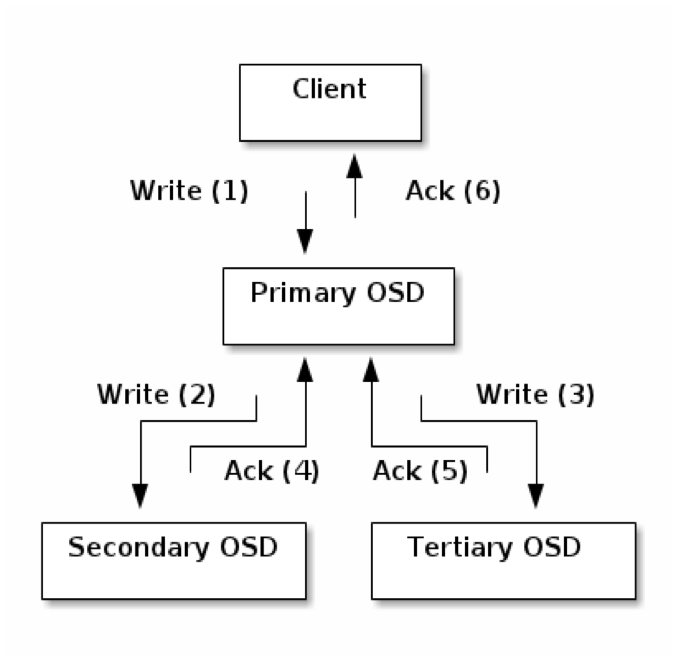
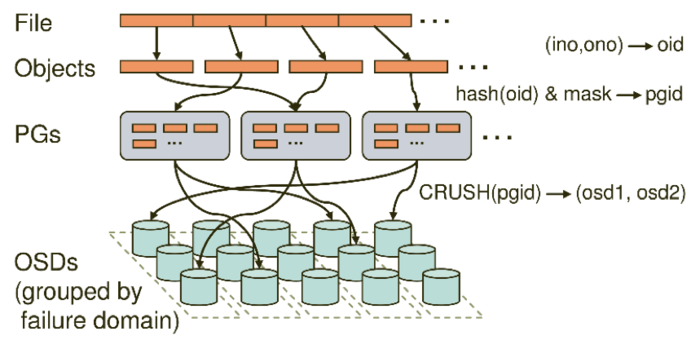
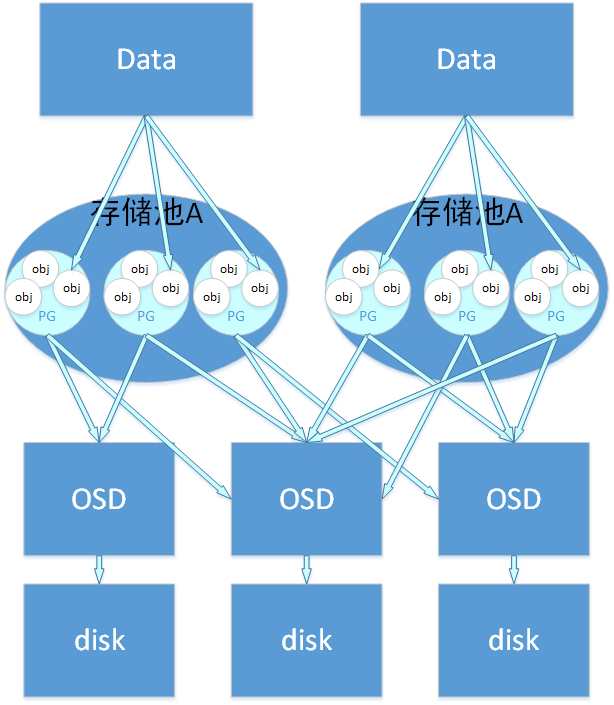
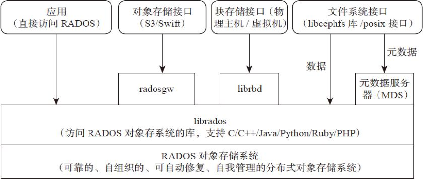
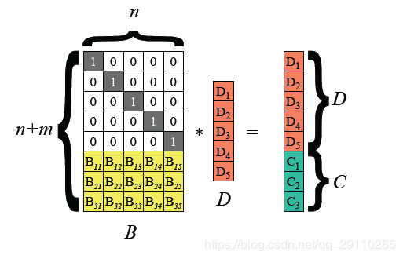
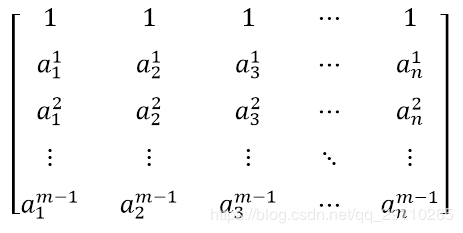
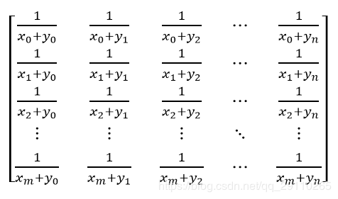
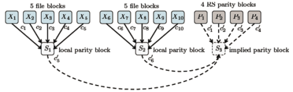
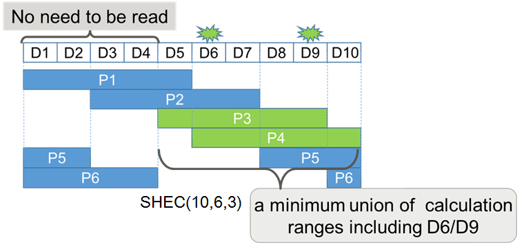
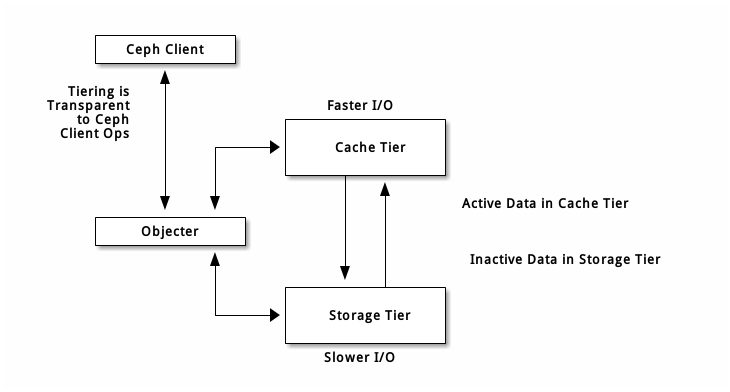

# 终期报告
## 项目内容
在ceph的平台上对纠删码模块进行改进，使用柯西矩阵进行编码，使用intel的SIMD指令集机型矩阵计算的加速，对于数据进行增量的方式修改，对于不同的数据进行分层的管理，达到更好的容错性和可用性。
## 小组成员
张灏文  
张铭哲  
刘硕  
陈云开  
毕超  
## ceph
### ceph简介
Ceph是一个可靠地、自动重均衡、自动恢复的分布式存储系统，根据场景划分可以将Ceph分为三大块，分别是对象存储、块设备存储和文件系统服务。在虚拟化领域里，比较常用到的是Ceph的块设备存储，比如在OpenStack项目里，Ceph的块设备存储可以对接OpenStack的cinder后端存储、Glance的镜像存储和虚拟机的数据存储，比较直观的是Ceph集群可以提供一个raw格式的块存储来作为虚拟机实例的硬盘。  
Ceph相比其它存储的优势点在于它不单单是存储，同时还充分利用了存储节点上的计算能力，在存储每一个数据时，都会通过计算得出该数据存储的位置，尽量将数据分布均衡，同时由于Ceph的良好设计，采用了CRUSH算法、HASH环等方法，使得它不存在传统的单点故障的问题，且随着规模的扩大性能并不会受到影响。 
### 相关概念的简单介绍
#### Monitor
一个Ceph集群需要多个Monitor组成的小集群，它们通过Paxos同步数据，用来保存OSD的元数据。
#### OSD
OSD全称Object Storage Device，也就是负责响应客户端请求返回具体数据的进程。一个Ceph集群一般都有很多个OSD。
#### MDS
MDS全称Ceph Metadata Server，是CephFS服务依赖的元数据服务。
#### Object
Ceph最底层的存储单元是Object对象，每个Object包含元数据和原始数据。
#### PG
PG全称Placement Grouops，是一个逻辑的概念，一个PG包含多个OSD。引入PG这一层其实是为了更好的分配数据和定位数据。
#### RADOS
RADOS全称Reliable Autonomic Distributed Object Store，是Ceph集群的精华，用户实现数据分配、Failover等集群操作。
#### Libradio
Librados是Rados提供库，因为RADOS是协议很难直接访问，因此上层的RBD、RGW和CephFS都是通过librados访问的，目前提供PHP、Ruby、Java、Python、C和C++支持。
#### CRUSH
CRUSH是Ceph使用的数据分布算法，类似一致性哈希，让数据分配到预期的地方。
#### RBD
RBD全称RADOS block device，是Ceph对外提供的块设备服务。
#### RGW
RGW全称RADOS gateway，是Ceph对外提供的对象存储服务，接口与S3和Swift兼容。
#### CephFS
CephFS全称Ceph File System，是Ceph对外提供的文件系统服务。
### Ceph的核心组件（底层）
#### OSD
用于集群中所有数据与对象的存储。处理集群数据的复制、恢复、回填、均衡。并向其他OSD守护进程发送心跳，然后向Monitor提供一些监控信息。
#### Monitor
独立部署的daemon进程，通过组成Monitor集群来保证自己的高可用。Monitor集群通过Paxos算法实现了自己数据的一致性。维护集群的cluster MAP二进制表。ClusterMAP描述了对象块存储的物理位置，以及一个将设备聚合到物理位置的桶列表。Monitor节点中保存了最新的版本集群数据分布图（cluster map）的主副本。客户端在使用时，需要挂载Monitor节点的6789端口，下载最新的cluster map，通过crush算法获得集群中各osd的IP地址，然后再与osd节点直接建立连接来传输数据。所以对于ceph来说，并不需要有集中式的主节点用于计算与寻址，客户端分摊了这部分工作。而且客户端也可以直接和osd通信，省去了中间代理服务器的额外开销。

#### MDS

Ceph 元数据服务器（ MDS ）为 Ceph 文件系统存储元数据（也就是说，Ceph 块设备和 Ceph 对象存储不使用MDS ）。元数据服务器使得 POSIX 文件系统的用户们，可以在不对 Ceph 存储集群造成负担的前提下，执行诸如 ls、find 等基本命令。

### 注意事项
Rados对象是数据存储的基本单元，一般默认4MB大小；用唯一标识一个对象。  
OSD是负责物理存储的进程，一般情况下，配置为和磁盘一一对应，一块磁盘启动一个OSD进程；一个OSD上可以分布多个PG；OSD设备是存储rados对象的载体。  
PG是OSD之上的一层逻辑，可视其为一个逻辑概念；一个对象只能属于一个PG，一个PG包含很多个对象(rados object)；一个PG对应于一个OSD列表，相同PG内的对象都会放到相同的硬盘上；服务端数据均衡和恢复的最小粒度就是PG；  
Pool是一个抽象的存储池，它是PG之上的一层逻辑；规定了数据冗余的类型以及对应的副本分布策略；一个pool由多个PG构成，一个PG只能属于一个POOL；  

在Ceph存储系统中，数据存储分三个映射过程
首先要将用户要操作的file，映射为RADOS能够处理的object。就是简单的按照object的size对file进行切分，相当于RAID中的条带化过程。
接着把Object映射到PG，在file被映射为一个或多个object之后，就需要将每个object独立地映射到一个PG中去。
第三次映射就是将作为object的逻辑组织单元的PG映射到数据的实际存储单元OSD。
文件存入时，首先把File切分为RADOS层面的Object，每个Object一般为2MB或4MB(大小可设置)。每个Object通过哈希算法映射到唯一的PG。每个PG通过Crush算法映射到实际存储单元OSD，PG和OSD间是多对多的映射关系。

### Ceph的核心组件（上层）
#### Object
有原生的API，而且也兼容Swift和S3的API。
#### Block
支持精简配置、快照、克隆。
#### File
Posix接口，支持快照。

## ceph搭建
### 搭建经过
对于ceph搭建，我们首先是在虚拟机上实现的。这样的做法可以首先让我们熟悉搭建ceph的环境，也可以更好的了解我们需要做的事情。
对于这部分的内容我们也制作了专门的相关文档进行阐述，在这里就不做太过于详细的解释，这里有一个查看我们关于ceph搭建的一系列经验和步骤，有兴趣的同学可以自行查看。
[传送门](https://github.com/OSH-2019/x-Erasure-Code-Improvement-based-on-ceph/tree/master/docs/ceph%20install)

### 搭建中遇到的问题
我们在搭建中首先遇到最大的问题是关于ip地址和对于一些参数修改方面的。对于网上的种种资料常常在质量上良莠不齐，导致我们在中间走了很多弯路，至于官方文档上的内容却常常有很多内容不有提醒，例如我们自己电脑配置的时候经常在环境上收到阻隔和限制，不能刚开始直接按照官方文档直接一路畅通下来。最后，我们在不断的摸索中，万幸还是解决了问题，最终还是搭出了我们自己的ceph。我当时还是组员说，感觉查看ceph的状态给我的感觉比让我高考查分的状态还要忐忑。（笑）

#### 搭建时的一些建议
- 首先一定要注意对ceph.conf的修改（只有拥有一个正确的ceph.conf才可以搭出ceph）  
- 对于ip地址的配置，首先一定要搞清楚具体要做一些什么，否则在ssh上没有解决相互的通信，之后的一切内容都是白谈（我们组也的确白谈了很多时间）。  
- 在具体安装时，经常会遇到镜像上的问题，所以一定要选用可靠的镜像源，我在这里比较推荐的镜像时阿里镜像，使用起来比较可靠。  
- 在具体使用之前，一定要搞清楚每一步究竟是在做什么，否则很有可能会做无用功，例如我们小组刚开始的时候始终没有明白那些具体安装的内容是在具体的某个节点上，还是在每个节点上进行操作。 
- 对于centos报错的解决，虽然学长的确帮我们解决了机器的问题，但是初始阶段机器的配置都是有区别的，甚至在很多地方出现了不可用的情况，（我们也不好意思继续麻烦学长）解决这些问题又花费了我们好多时间。
## 纠删码
### 简介
Erasure Code（EC），即纠删码，是一种前向错误纠正技术（Forward Error Correction，FEC，），主要应用在网络传输中避免包的丢失， 存储系统利用它来提高 存储 可靠性。相比多副本复制而言， 纠删码能够以更小的数据冗余度获得更高数据可靠性， 但编码方式较复杂，需要大量计算 。纠删码只能容忍数据丢失，无法容忍数据篡改，纠删码正是得名与此。
### jeasure插件
jerasure 插件是最通用、最灵活的插件，也是 Ceph 纠删码存储池的默认插件。在jerasure插件中支持如下的编码方式：
RS编码以word为编码和解码单位，大的数据块拆分到字长为w（取值一般为8或者16位）的word，然后对word进行编解码。 数据块的编码原理与word编码原理相同，后文中一word为例说明，变量Di, Ci将代表一个word。  
把输入数据视为向量D=(D1，D2，..., Dn）, 编码后数据视为向量（D1, D2,..., Dn, C1, C2,.., Cm)，RS编码可视为如下图所示矩阵运算。
  
上图最左边是编码矩阵（或称为生成矩阵、分布矩阵，Distribution Matrix），编码矩阵需要满足任意n*n子矩阵可逆。  
为方便数据存储，编码矩阵上部是单位阵（n行n列），下部是m行n列矩阵。下部矩阵可以选择范德蒙德矩阵或柯西矩阵。后文说明。
#### 基于范德蒙德（Vandermonde）矩阵
在线性代数中有一种矩阵称为范德蒙德矩阵，它的任意的子方阵均为可逆方阵。一个m行n列的范德蒙德矩阵定义如下，其中Ai 均不相同，且不为0。  

采用这种方法的算法复杂度还是比较高的，编码复杂度为O（mn），其中m为校验数据个数，n为输入数据个数。解码复杂度为O（n^3）。  
#### 基于柯西（ Cauchy）矩阵
柯西矩阵的任意一个子方阵都是奇异矩阵，存在逆矩阵。而且柯西矩阵在迦罗华域上的求逆运算，可以在O（n^2）的运算复杂度内完成。  
使用柯西矩阵，比范德蒙德矩阵的优化主要有两点：
1）降低了矩阵求逆的运算复杂度。范德蒙矩阵求逆运算的复杂度为O（n^3），而柯西矩阵求逆运算的复杂度仅为O（n^2）。  
2）通过有限域转换，将GF（2^w）域中的元素转换成二进制矩阵，将乘法转换为逻辑与，降低了乘法运算复杂度。（二进制的加法即XOR，乘法即AND）  
柯西矩阵的描述如下：  

### isa插件
在之前介绍的过关于jeasure插件的矩阵计算的基础之上，由于可以isa库对于intel的处理器上使用的情况上，运用了SIMD指令集的技术进行加速，然后进一步加快了矩阵的运算。
#### SIMD
SIMD全称Single Instruction Multiple Data，单指令多数据流，能够复制多个操作数，并把它们打包在大型寄存器的一组指令集。
### LRC插件
#### 简介
用 jerasure 插件时，纠删码编码的对象存储在多个 OSD 上，丢失一个 OSD 的恢复过程需读取所有其他的 OSD 。比如 jerasure 的配置为 k=8 且 m=4 ，丢失一个 OSD 后需读取其他 11 个 OSD 才能恢复。
lrc 纠删码插件创建的是局部校验块，这样只需较少的 OSD 即可恢复。比如 lrc 的配置为 k=8 、 m=4 且 l=4 ，它将为每四个 OSD 创建额外的校验块，当一个 OSD 丢失时，它只需四个 OSD 即可恢复，而不需要十一个。   
使用LRC就会生成额外的局部校验块，这对于带宽方面还是有比较明显的提升的。使用局部校验块可以降低主机间的恢复带宽，同时也可以降低机架间的恢复带宽。  

### SHEC插件
 SHEC(Shingled Erasure Code)利用多个奇偶校组验实现EC算法, SHEC(k,m,c), 表示k个有效数据块, m个奇偶校验块, 可以容忍c个块错误. SHEC能快速的恢复数据,是因为每个坏块都可以做到局部数据恢复,而无需读取全局数据才能恢复.对于数据的读取速度没有影响. 但是一般c数值小于m, 所以SHEC的空间利用率相对低.  一般认为,SHEC(mSHEC)算法用于需要快速恢复数据的场合。

### CLAY插件
CLAY（coupled-layer的缩写）代码是一种擦除代码，旨在在修复故障节点/OSD/机架时显著节省网络带宽和磁盘IO。  
## 分级缓存
分级缓存可提升后端存储内某些（热点）数据的 I/O 性能。分级缓存需创建一个由高速而昂贵存储设备（如 SSD ）组成的存储池、作为缓存层，以及一个相对低速/廉价设备组成的后端存储池（或纠删码编码的）、作为经济存储层。 Ceph 的对象处理器决定往哪里存储对象，分级代理决定何时把缓存内的对象刷回后端存储层；所以缓存层和后端存储层对 Ceph 客户端来说是完全透明的。      
  
缓存层代理自动处理缓存层和后端存储之间的数据迁移。然而，管理员仍可干预此迁移规则，主要有两种场景：  
- 回写模式： 管理员把缓存层配置为 writeback 模式时， Ceph 客户端们会把数据写入缓存层、并收到缓存层发来的 ACK ；写入缓存层的数据会被迁移到存储层、然后从缓存层刷掉。直观地看，缓存层位于后端存储层的“前面”，当 Ceph 客户端要读取的数据位于存储层时，缓存层代理会把这些数据迁移到缓存层，然后再发往 Ceph 客户端。从此， Ceph 客户端将与缓存层进行 I/O 操作，直到数据不再被读写。此模式对于易变数据来说较理想（如照片/视频编辑、事务数据等）。    
- 只读模式： 管理员把缓存层配置为 readonly 模式时， Ceph 直接把数据写入后端。读取时， Ceph 把相应对象从后端复制到缓存层，根据已定义策略、脏对象会被缓存层踢出。此模式适合不变数据（如社交网络上展示的图片/视频、 DNA 数据、 X-Ray 照片等），因为从缓存层读出的数据可能包含过期数据，即一致性较差。对易变数据不要用 readonly 模式。    
正因为所有 Ceph 客户端都能用缓存层，所以才有提升块设备、 Ceph 对象存储、 Ceph 文件系统和原生绑定的 I/O 性能的潜力。      
### 配置存储池
要设置缓存层，你必须有两个存储池。一个作为后端存储、另一个作为缓存。  
#### 配置后端存储池
设置后端存储池通常会遇到两种场景：  
- 标准存储： 此时，Ceph存储集群内的存储池保存了一对象的多个副本；   
- 纠删存储池： 此时，存储池用纠删码高效地存储数据，性能稍有损失。    
在标准存储场景中，你可以用 CRUSH 规则集来标识失败域（如 osd 、主机、机箱、机架、排等）。当规则集所涉及的所有驱动器规格、速度（转速和吞吐量）和类型相同时， OSD 守护进程运行得最优。创建规则集的详情见 CRUSH 图。创建好规则集后，再创建后端存储池。        
在后续例子中，我们把 cold-storage 当作后端存储池。    
#### 配置缓存池  
缓存存储池的设置步骤大致与标准存储情景相同，但仍有不同：缓存层所用的驱动器通常都是高性能的、且安装在专用服务器上、有自己的规则集。制定规则集时，要考虑到装有高性能驱动器的主机、并忽略没有的主机。详情见给存储池指定 OSD 。  
在后续例子中， hot-storage 作为缓存存储池、 cold-storage 作为后端存储池。
### 创建缓存层
  

设置一缓存层需把缓存存储池挂接到后端存储池上：  

	ceph osd tier add cold-storage hot-storage

用下列命令设置缓存模式：
	
	ceph osd tier set-overlay cold-storage hot-storage

### 配置缓存层
缓存层支持几个配置选项，可按下列语法配置：

	ceph osd pool set {cachepool} {key} {value}

## 日志记录
### osd日志
Ceph OSD日志也是一种事务日志，它是基于文件系统的OSD的关键组成部分，提供存储系统所需的一致性保证。
让我们从Ceph documentation中有关日志的描述开始：
Ceph OSD使用日志有两个原因：速度及一致性。

- 速度： 日志使得Ceph OSD Daemon进程能够快速的提交小IO。Ceph将小的随机IO顺序的写入日志，让后端文件-系统有更多时间来合并IO，提升系统的突发负载能力。然而，这可能带来剧烈的性能抖动，表现为一段时间内的高速写入，而之后一段时间内没有任何写入直至文件系统追上日志的进度。
- 一致性：Ceph OSD Daemon进程需要一个文件系统接口来保证多个操作的原子性。Ceph OSD Daemon进程提交操作描述到日志并将操作应用到文件系统。这使得能够原子的更新一个对象（如：pg metadata)。在filestore配置的[min_sync_interval max_sync_interval]间隔范围内，Ceph OSD Daemon进程会停止写操作,并同步文件系统与日志，建立同步点[译者注：此时会记录已同步的最大Seq号]，以便Ceph OSD Daemon清除日志项、重用日志空间。在故障发生后，Ceph OSD Daemon从最后一个同步操作点开始重放日志。

## 测试
## 总结
纠删码对于ceph甚至所有的分布式系统这类对于文件一致性有要求的文件都是由很强的运用前景的。而对于纠删码而言，虽然是有很强的运用背景，但是就像是世界上没有一个十全十美的东西，他本是还是建立在计算付出的基础之上的，所以对于那些小文件的不断存入可能并不是一种看起来十分美好的解决方式。  
在这个大作业的内容中，我们其实很多地方都做得不是很好，例如在时间的分配上，我们使用了好多时间都在做无用功，例如对于知识的学习花了过多的时间，对于配置种种参数的内容总是很难去实现。并且也不是很有效的利用了一起学习和交流的时间，所以导致我们组的效率并没有开始认为的那样可以做到什么非常喜人的结果。但是，我们还是比较好的完成了一开始既定的任务，完成了在ceph上对于纠删码插件的修改和使用，并且对性能进行了测试，并且得出了我们的之前想要的结果。  
## 鸣谢
首先感谢老师和助教，以及我们的学长在我们这个大作业上给我们的帮助，让我们可以比较好的布局安排，最后完成我们的这个大作业。其次，在我们这个实验上，我们最后之所以可以完成我们的新项目多要归功于ceph这个强大的社区和平台，我们要非常感谢ceph社区的贡献和在这背后的种种辛勤付出的人们。我们小组的同学在完成这个大作业的过程中，也难免遇到一些困难和问题，但是我们并没有在当时选择放弃，我们可以最后完成我们的实验也要归功于我们小组同学在实验过程中不断努力，完成实验的勇气和态度。
